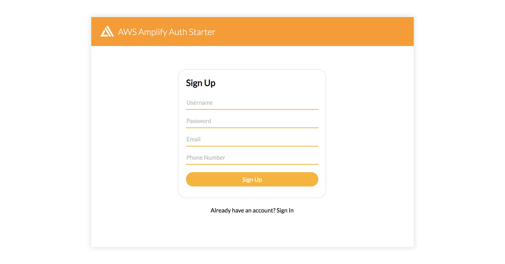

### This is the React Starter

# Added ability to upload pictures

*Modified src/Home.js, added a new function called "App"
- This function defines an upload and download button, connects to S3 storage
- uses the word "private" so that only the logged in user can see/modify their files

```react
downloadUrl = await Storage.vault.get('xx.jpg', { level: 'private' }); 
```

- Need to use async when you have await
```react
        files.forEach(async (file) =>{
        console.log(file.key)
        const downloadUrl = await Storage.vault.get(file.key, { level: 'private' });
```

- To control the amount of time the storage item is available, use "expires"
```react
    const downloadUrl = await Storage.get('picture.jpg', { expires: 300 });
```
*Here's the code
```react
const App = () => {
  const [imageUrl, setImageUrl] = useState(null);
  const [loading, setLoading] = useState(false);

  const downloadUrl = async () => {
    // Creates download url that expires in 5 minutes/ 300 seconds
    const downloadUrl = await Storage.vault.get('xx.jpg', { level: 'private' });
    const files = await Storage.vault.list('');
    files.forEach(async (file) =>{
        console.log(file.key)
        const downloadUrl = await Storage.vault.get(file.key, { level: 'private' });
        console.log(downloadUrl);
        });
    //console.log('files: ', files);
    //console.log(downloadUrl);
    //window.location.href = downloadUrl;
  }

  const handleChange = async (e) => {
    const file = e.target.files[0];
    console.log(file.name);
    try {
      setLoading(true);
      // Upload the file to s3 with private access level.
      await Storage.put(file.name, file, {
        level: 'private',
        contentType: 'image/jpg'
      });
      // Retrieve the uploaded file to display
      const url = await Storage.get(file.name, { level: 'private' })
      setImageUrl(url);
      setLoading(false);
    } catch (err) {
      console.log(err);
    }
  }

  return (
    <div className="App">
      <h1> Upload an Image </h1>
      {loading ? <h3>Uploading...</h3> : <input
        type="file" accept='image/jpg'
        onChange={(evt) => handleChange(evt)}
      />}
      <div>
        {imageUrl ?  : <span />}
      </div>
      <div>
        <h2>Download URL?</h2>
        <button onClick={() => downloadUrl()}>Click Here!</button>
      </div>
    </div>
  );
```

# In the Home component, now add in the "App" element defined above
```react
class Home extends React.Component {
  static contextType = UserContext;

  render() {
    const isAuthenticated = this.context.user && this.context.user.username ? true : false
    return (
      <Container>
        <h1>Welcome</h1>
        {
          isAuthenticated && (
            <>
                <App />
            </>
          )
        }
      </Container>
    )
  }
}
```
# AWS Amplify React Authentication Starter



## This project includes:    
- User sign up
- User sign in
- 2 factor authentication
- Real world auth flow using React Router
- Protected routes
- Redirects for unauthorized users
- Time-based one time password (TOTP)    

## Getting started    

-  ~/.aws/config 
```
[profile amplify-app]
region=us-west-2
```

-  ~/.aws/credentials
```
[amplify-app]
aws_access_key_id=xxxx
aws_secret_access_key=xxxx
```
#### Initial setup

1. Make sure you are on a new version of the AWS Amplify CLI to be sure you have multiple environment support.

```sh
npm install -g @aws-amplify/cli
```

2. clone the project    

```sh
git clone https://github.com/aws-samples/aws-amplify-auth-starters.git
```

3. Check out the React branch

```sh
git checkout react
```

4. install dependencies using npm or yarn    

```sh
npm install
```

5. Start project    

```sh
npm start
```

#### Setting up back end AWS services

If you do not have your AWS services already created, follow these steps. If you already have your services set up, just configure your aws-exports.js file.    

1. From the root of the project, initialize the Amplify project    

```sh
amplify configure
```
```sh
amplify init
```
- Create cognito pool and cognito identity in the aws console

```sh
amplify add auth
```
```sh
amplify add storage
```

2. Create the resources in your account

```sh
amplify push
```

#### Enabling MFA

1. Visit the [Amazon Cognito User Pool Dashboard](https://console.aws.amazon.com/cognito/users) & click on your user pool.

```sh
amplify console auth
```

2. Click on MFA & verifications

3. Do you want to enable Multi-Factor Authentication (MFA)? __Optional__
